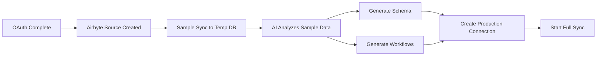

# Corrected Enterprise Implementation Plan

## Key Insight: Airbyte IS Our Data Fetcher!

### What We Actually Need to Build:

## Phase 1: Airbyte Data Sampling & Analysis

### 1.1 Sample Data Retrieval from Airbyte
```typescript
// services/AirbyteDataSampler.ts
class AirbyteDataSampler {
  async getSampleData(sourceId: string): Promise<SampleData> {
    // Option 1: Use Airbyte's discover schema endpoint
    const schema = await this.airbyte.discoverSchema(sourceId)
    
    // Option 2: Create temporary connection to sample destination
    const sampleConnection = await this.airbyte.createConnection({
      sourceId,
      destinationId: this.sampleDestinationId, // In-memory or temp DB
      schedule: { type: 'manual' },
      configurations: {
        limit: 1000 // Sample size per stream
      }
    })
    
    // Trigger one-time sync
    const job = await this.airbyte.triggerSync(sampleConnection.id)
    await this.waitForCompletion(job.id)
    
    // Read from sample destination
    const data = await this.readSampleData(sampleConnection)
    
    // Clean up
    await this.airbyte.deleteConnection(sampleConnection.id)
    
    return data
  }
}
```

### 1.2 The Correct Flow


## Phase 2: AI Analysis of Airbyte Data

### 2.1 Analyze Data from Airbyte Sync
```typescript
// services/AIDataAnalyzer.ts
class AIDataAnalyzer {
  async analyzeAirbyteData(
    sourceId: string,
    provider: string
  ): Promise<BusinessAnalysis> {
    // Get sample data via Airbyte
    const sampleData = await this.airbyteSampler.getSampleData(sourceId)
    
    // Prepare data for AI analysis
    const analysisInput = {
      provider,
      streams: sampleData.streams.map(stream => ({
        name: stream.name,
        schema: stream.jsonSchema,
        sampleRecords: stream.data.slice(0, 10),
        recordCount: stream.data.length,
        fields: Object.keys(stream.jsonSchema.properties)
      }))
    }
    
    // Send to AI for analysis
    const analysis = await this.openai.chat.completions.create({
      model: "gpt-4-turbo",
      messages: [{
        role: "system",
        content: `Analyze this ${provider} data and identify:
          1. Business type and model
          2. Key entities and relationships
          3. Important metrics and KPIs
          4. Data quality issues
          5. Suggested database schema
          6. Recommended workflows`
      }, {
        role: "user",
        content: JSON.stringify(analysisInput)
      }],
      response_format: { type: "json_object" }
    })
    
    return this.parseAnalysis(analysis)
  }
}
```

## Phase 3: Schema Generation Based on Airbyte Catalog

### 3.1 Convert Airbyte Schema to Optimized Database
```typescript
// services/SchemaGenerator.ts
class AirbyteSchemaOptimizer {
  async generateDatabaseSchema(
    airbyteCatalog: AirbyteCatalog,
    businessAnalysis: BusinessAnalysis
  ): Promise<DatabaseSchema> {
    // Airbyte provides the raw schema
    const rawSchema = this.extractSchemaFromCatalog(airbyteCatalog)
    
    // AI optimizes it for the specific business
    const optimizedSchema = await this.openai.chat.completions.create({
      model: "gpt-4-turbo",
      messages: [{
        role: "system",
        content: `Optimize this Airbyte schema for ${businessAnalysis.businessType}:
          - Add proper relationships and foreign keys
          - Create junction tables for many-to-many
          - Add indexes for common query patterns
          - Include calculated fields and views
          - Add audit columns
          - Optimize data types`
      }, {
        role: "user",
        content: JSON.stringify({ rawSchema, businessAnalysis })
      }]
    })
    
    return this.generateMigrations(optimizedSchema)
  }
}
```

## Phase 4: Workflow Generation from Real Data Patterns

### 4.1 Analyze Airbyte Sync Logs for Patterns
```typescript
// services/WorkflowIntelligence.ts
class DataDrivenWorkflowGenerator {
  async generateWorkflows(
    connectionId: string,
    businessAnalysis: BusinessAnalysis
  ): Promise<Workflow[]> {
    // Get sync history from Airbyte
    const syncJobs = await this.airbyte.getJobs(connectionId)
    
    // Analyze data changes over time
    const patterns = await this.analyzeDataPatterns(syncJobs)
    
    // Generate workflows based on real patterns
    const workflows = await this.openai.chat.completions.create({
      model: "gpt-4-turbo",
      messages: [{
        role: "system",
        content: `Based on these data patterns from ${businessAnalysis.businessType}, 
          create workflows that:
          - Respond to common data changes
          - Prevent issues we've detected
          - Optimize operations
          
          Patterns detected: ${JSON.stringify(patterns)}`
      }]
    })
    
    return this.convertToTemporalWorkflows(workflows)
  }
}
```

## The Correct Architecture

```typescript
// The right way to use Airbyte in the flow
class EnterpriseOnboardingOrchestrator {
  async onboardTenant(tenantId: string, oauthTokens: OAuthTokens[]) {
    // 1. Create Airbyte sources (already done)
    const sources = await this.createAirbyteSources(oauthTokens)
    
    // 2. Run sample syncs to temporary destination
    const sampleData = await this.runSampleSyncs(sources)
    
    // 3. AI analyzes the sample data
    const analysis = await this.aiAnalyzer.analyze(sampleData)
    
    // 4. Generate optimal schema based on analysis
    const schema = await this.schemaGenerator.generate(
      sampleData.catalog,
      analysis
    )
    
    // 5. Provision production database with optimal schema
    const database = await this.databaseProvisioner.provision(
      tenantId,
      schema
    )
    
    // 6. Create production Airbyte connections
    const connections = await this.createProductionConnections(
      sources,
      database,
      schema.transformations
    )
    
    // 7. Generate workflows based on data patterns
    const workflows = await this.workflowGenerator.generate(
      analysis,
      connections
    )
    
    // 8. Generate UI based on available data
    const dashboard = await this.dashboardGenerator.generate(
      schema,
      analysis,
      workflows
    )
    
    // 9. Deploy everything
    return this.deployApplication({
      tenantId,
      database,
      connections,
      workflows,
      dashboard
    })
  }
}
```

## What This Means for Implementation

### Use Airbyte's Strengths:
1. **Data Collection** ✅ (Airbyte does this)
2. **Schema Discovery** ✅ (Airbyte provides raw schema)
3. **Incremental Sync** ✅ (Airbyte handles this)
4. **Transform & Load** ✅ (Airbyte's DBT integration)

### What We Build on Top:
1. **Sample Data Analysis** - Get small dataset for AI analysis
2. **Business Intelligence** - Understand what the data means
3. **Schema Optimization** - Improve Airbyte's schema for specific use case
4. **Workflow Generation** - Create automations based on data patterns
5. **UI Generation** - Build dashboards for the specific data

## Simplified Implementation Steps

### Step 1: Sample Sync Endpoint
```typescript
// api/airbyte/sample-sync/route.ts
export async function POST(request: Request) {
  const { sourceId } = await request.json()
  
  // Create temporary destination
  const tempDest = await createTempDestination()
  
  // Create connection with limit
  const connection = await airbyte.createConnection({
    sourceId,
    destinationId: tempDest.id,
    configurations: { sync_mode: 'full_refresh', limit: 100 }
  })
  
  // Run sync
  const job = await airbyte.triggerSync(connection.id)
  await waitForJob(job.id)
  
  // Read sample data
  const data = await readFromTempDest(tempDest)
  
  // Cleanup
  await cleanupTemp(connection.id, tempDest.id)
  
  return Response.json({ data })
}
```

### Step 2: Analyze Sample Data
```typescript
// Use the sample data for AI analysis
const analysis = await analyzeWithAI(sampleData)
const schema = await generateOptimalSchema(sampleData, analysis)
const workflows = await suggestWorkflows(analysis)
```

### Step 3: Setup Production Pipeline
```typescript
// Now create the real Airbyte connection with optimizations
const prodConnection = await airbyte.createConnection({
  sourceId,
  destinationId: prodDatabase.id,
  schedule: analysis.recommendedSchedule,
  transformations: schema.transformations,
  configurations: analysis.optimizedSettings
})
```

This approach leverages Airbyte's strengths while adding AI intelligence on top!