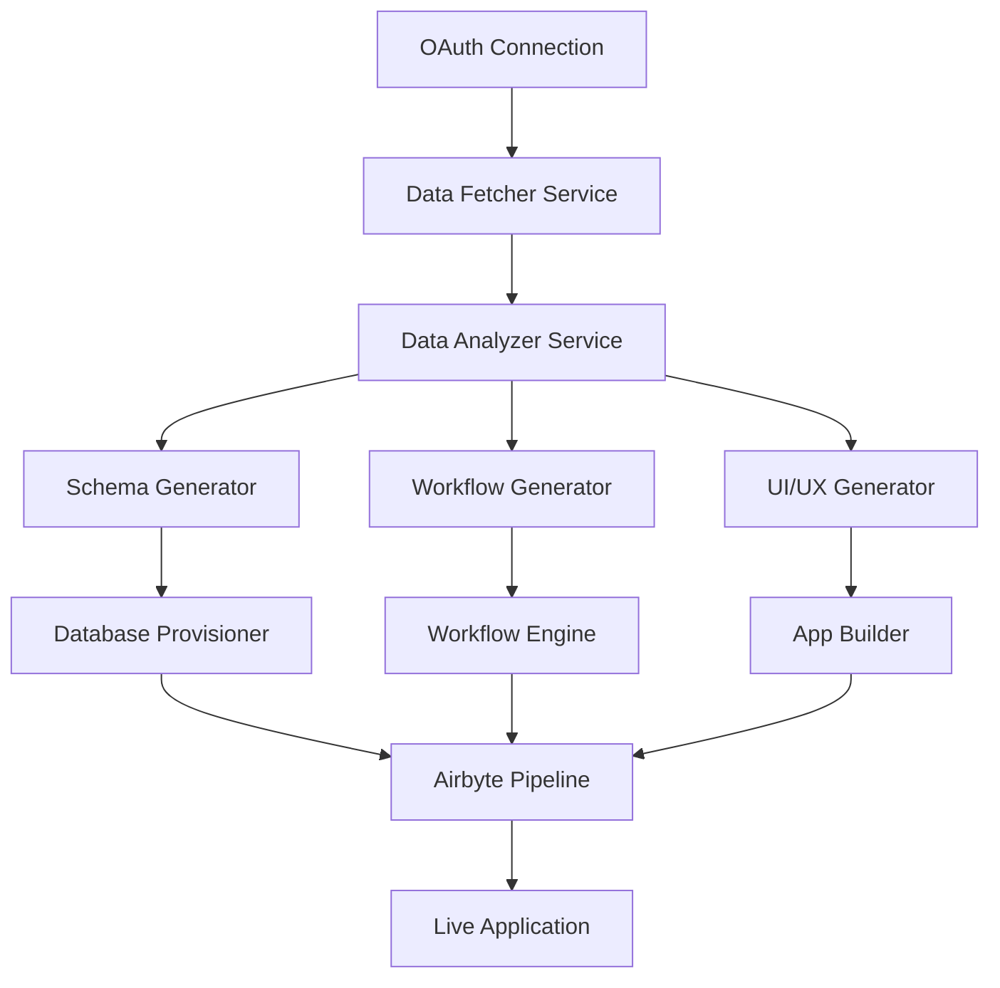

# Enterprise-Level AI-Powered Onboarding Implementation

## Architecture Overview



## Phase 1: Data Collection & Analysis Infrastructure

### 1.1 Enhanced Data Fetcher Service
```typescript
// services/DataFetcherService.ts
interface DataFetcherService {
  fetchComprehensiveData(provider: string, accessToken: string): Promise<ProviderData>
  detectDataPatterns(data: ProviderData): Promise<DataPatterns>
  identifyBusinessMetrics(data: ProviderData): Promise<BusinessMetrics>
}

class EnterpriseDataFetcher implements DataFetcherService {
  private readonly providers: Map<string, ProviderAdapter>
  private readonly cache: RedisCache
  private readonly rateLimiter: RateLimiter
  
  async fetchComprehensiveData(provider: string, accessToken: string) {
    const adapter = this.providers.get(provider)
    
    // Parallel fetch with circuit breaker
    const data = await Promise.all([
      this.fetchWithRetry(() => adapter.getEntities(accessToken)),
      this.fetchWithRetry(() => adapter.getMetrics(accessToken)),
      this.fetchWithRetry(() => adapter.getRelationships(accessToken)),
      this.fetchWithRetry(() => adapter.getHistoricalData(accessToken))
    ])
    
    return this.normalizeData(data)
  }
}
```

### 1.2 Provider Adapters
```typescript
// adapters/GitHubAdapter.ts
class GitHubAdapter implements ProviderAdapter {
  async getEntities(token: string) {
    const octokit = new Octokit({ auth: token })
    
    // Fetch all relevant entities
    const [repos, issues, prs, users, workflows] = await Promise.all([
      this.fetchAllPages(octokit.repos.listForAuthenticatedUser),
      this.fetchAllPages(octokit.issues.listForAuthenticatedUser),
      this.fetchAllPages(octokit.pulls.list),
      this.fetchAllPages(octokit.users.listFollowers),
      this.fetchAllPages(octokit.actions.listWorkflows)
    ])
    
    return { repos, issues, prs, users, workflows }
  }
  
  private async fetchAllPages(apiMethod: Function, maxPages = 10) {
    // Implement pagination with rate limiting
  }
}
```

## Phase 2: AI-Powered Analysis Engine

### 2.1 Business Intelligence Analyzer
```typescript
// services/AIAnalyzer.ts
class AIBusinessAnalyzer {
  private openai: OpenAI
  private vertexAI: VertexAI // For redundancy
  
  async analyzeBusinessModel(data: ComprehensiveData): Promise<BusinessAnalysis> {
    // Multi-model approach for accuracy
    const [openAIAnalysis, vertexAnalysis] = await Promise.all([
      this.analyzeWithOpenAI(data),
      this.analyzeWithVertex(data)
    ])
    
    // Consensus mechanism
    return this.mergeAnalyses(openAIAnalysis, vertexAnalysis)
  }
  
  private async analyzeWithOpenAI(data: ComprehensiveData) {
    const systemPrompt = `
      You are an expert business analyst. Analyze the provided data and return:
      1. Business type and model
      2. Key performance indicators
      3. Data relationships and dependencies
      4. Recommended database schema
      5. Suggested automation workflows
      
      Return as structured JSON matching the BusinessAnalysis interface.
    `
    
    return this.openai.chat.completions.create({
      model: "gpt-4-turbo",
      messages: [
        { role: "system", content: systemPrompt },
        { role: "user", content: this.prepareDataForAnalysis(data) }
      ],
      response_format: { type: "json_object" },
      temperature: 0.3 // Lower for consistency
    })
  }
}
```

### 2.2 Pattern Recognition Engine
```typescript
// services/PatternEngine.ts
class PatternRecognitionEngine {
  async detectPatterns(data: ComprehensiveData): Promise<DataPatterns> {
    return {
      temporalPatterns: await this.detectTemporalPatterns(data),
      behavioralPatterns: await this.detectBehavioralPatterns(data),
      anomalies: await this.detectAnomalies(data),
      correlations: await this.findCorrelations(data)
    }
  }
  
  private async detectTemporalPatterns(data: ComprehensiveData) {
    // Time-series analysis
    // Peak hours, seasonal trends, growth patterns
  }
}
```

## Phase 3: Intelligent Schema Generation

### 3.1 Dynamic Database Designer
```typescript
// services/SchemaGenerator.ts
class IntelligentSchemaGenerator {
  async generateOptimalSchema(
    analysis: BusinessAnalysis,
    patterns: DataPatterns
  ): Promise<DatabaseSchema> {
    const schema = await this.openai.chat.completions.create({
      model: "gpt-4-turbo",
      messages: [{
        role: "system",
        content: `Generate PostgreSQL schema with:
          - Proper normalization (3NF minimum)
          - Optimized indexes based on query patterns
          - Partitioning for large tables
          - Audit columns (created_at, updated_at, etc.)
          - Row-level security policies
          - Materialized views for complex queries`
      }, {
        role: "user",
        content: JSON.stringify({ analysis, patterns })
      }]
    })
    
    return this.validateAndOptimizeSchema(schema)
  }
  
  async provisionDatabase(schema: DatabaseSchema, tenantId: string) {
    // Create isolated database/schema
    const db = await this.databaseProvisioner.createTenantDatabase(tenantId)
    
    // Execute DDL with migrations
    await this.migrationRunner.run(schema.migrations, db)
    
    // Setup RLS policies
    await this.securityManager.applyPolicies(schema.policies, db)
    
    return db
  }
}
```

### 3.2 Schema Optimization
```typescript
interface SchemaOptimizer {
  optimizeIndexes(schema: DatabaseSchema, queryPatterns: QueryPattern[]): IndexStrategy
  suggestPartitioning(tableStats: TableStatistics): PartitionStrategy
  recommendMaterializedViews(commonQueries: Query[]): MaterializedView[]
}
```

## Phase 4: Workflow Automation Engine

### 4.1 AI Workflow Generator
```typescript
// services/WorkflowGenerator.ts
class AIWorkflowGenerator {
  async generateWorkflows(
    analysis: BusinessAnalysis,
    availableTriggers: Trigger[],
    businessGoals: BusinessGoal[]
  ): Promise<Workflow[]> {
    const prompt = this.buildWorkflowPrompt(analysis, availableTriggers, businessGoals)
    
    const workflows = await this.openai.chat.completions.create({
      model: "gpt-4-turbo",
      messages: [{ role: "system", content: prompt }],
      functions: workflowFunctions,
      function_call: "auto"
    })
    
    return this.validateWorkflows(workflows)
  }
  
  private buildWorkflowPrompt(analysis, triggers, goals) {
    return `
      Create automation workflows for ${analysis.businessType} that:
      1. Reduce manual work by 80%
      2. Prevent common errors
      3. Improve customer satisfaction
      4. Optimize operations
      
      Available triggers: ${JSON.stringify(triggers)}
      Business goals: ${JSON.stringify(goals)}
      
      Each workflow must have:
      - Clear ROI impact
      - Error handling
      - Notification strategy
      - Rollback capability
    `
  }
}
```

### 4.2 Workflow Execution Engine
```typescript
// services/WorkflowEngine.ts
class EnterpriseWorkflowEngine {
  private readonly queue: BullMQ
  private readonly temporal: TemporalClient
  
  async deployWorkflow(workflow: Workflow, tenantId: string) {
    // Convert to Temporal workflow
    const temporalWorkflow = this.convertToTemporal(workflow)
    
    // Register with proper isolation
    await this.temporal.registerWorkflow(temporalWorkflow, {
      namespace: `tenant-${tenantId}`,
      taskQueue: `${tenantId}-workflows`
    })
    
    // Setup monitoring
    await this.monitoringService.trackWorkflow(workflow.id)
  }
}
```

## Phase 5: Dynamic UI/UX Generation

### 5.1 AI-Powered Dashboard Builder
```typescript
// services/DashboardGenerator.ts
class AIDashboardGenerator {
  async generateDashboard(
    analysis: BusinessAnalysis,
    userPreferences: UserPreferences,
    dataSchema: DatabaseSchema
  ): Promise<DashboardConfig> {
    const dashboardSpec = await this.openai.chat.completions.create({
      model: "gpt-4-turbo",
      messages: [{
        role: "system",
        content: `Design a dashboard for ${analysis.businessType} with:
          - Mobile-first responsive design
          - Real-time data updates
          - Interactive visualizations
          - Accessibility compliance (WCAG 2.1)
          - Performance optimization
          
          Return React component structure with:
          - Component hierarchy
          - Data fetching strategy
          - State management approach
          - Chart configurations`
      }]
    })
    
    return this.generateReactComponents(dashboardSpec)
  }
  
  private async generateReactComponents(spec: DashboardSpec) {
    const components = await this.codeGenerator.generate({
      framework: 'next.js',
      styling: 'tailwind',
      charts: 'recharts',
      realtime: 'supabase-realtime',
      spec
    })
    
    return this.optimizeComponents(components)
  }
}
```

## Phase 6: Continuous Data Synchronization

### 6.1 Airbyte Pipeline Manager
```typescript
// services/AirbytePipelineManager.ts
class EnterprisePipelineManager {
  async setupDataPipeline(
    tenantId: string,
    sources: DataSource[],
    schema: DatabaseSchema
  ): Promise<Pipeline> {
    // Create isolated workspace
    const workspace = await this.airbyte.createWorkspace({
      name: `tenant-${tenantId}`,
      email: `tenant-${tenantId}@system.local`
    })
    
    // Setup sources with optimal configuration
    const airbyteSources = await Promise.all(
      sources.map(source => this.createOptimizedSource(source, workspace))
    )
    
    // Create destination with security
    const destination = await this.createSecureDestination(tenantId, schema, workspace)
    
    // Create connections with transformations
    const connections = await this.createIntelligentConnections(
      airbyteSources,
      destination,
      schema
    )
    
    return { workspace, sources: airbyteSources, destination, connections }
  }
  
  private async createIntelligentConnections(sources, destination, schema) {
    return Promise.all(sources.map(source => 
      this.airbyte.createConnection({
        sourceId: source.id,
        destinationId: destination.id,
        schedule: this.determineOptimalSchedule(source),
        transformations: this.generateTransformations(source, schema),
        normalization: 'custom',
        resourceRequirements: this.calculateResources(source)
      })
    ))
  }
}
```

### 6.2 Token Management Service
```typescript
// services/TokenManager.ts
class EnterpriseTokenManager {
  private readonly vault: HashiCordVault
  private readonly scheduler: CronScheduler
  
  async setupTokenRefresh(tenantId: string, provider: string, tokens: OAuth2Tokens) {
    // Store in Vault with encryption
    await this.vault.store(`${tenantId}/${provider}`, tokens, {
      encryption: 'aes-256-gcm',
      ttl: tokens.expires_in
    })
    
    // Schedule refresh job
    await this.scheduler.schedule({
      name: `refresh-${tenantId}-${provider}`,
      cron: this.calculateRefreshSchedule(tokens),
      job: async () => this.refreshToken(tenantId, provider)
    })
  }
  
  private async refreshToken(tenantId: string, provider: string) {
    const tokens = await this.vault.get(`${tenantId}/${provider}`)
    const newTokens = await this.oauth.refresh(provider, tokens.refresh_token)
    
    // Update everywhere
    await Promise.all([
      this.vault.update(`${tenantId}/${provider}`, newTokens),
      this.updateAirbyteSource(tenantId, provider, newTokens),
      this.notifyServices(tenantId, provider, newTokens)
    ])
  }
}
```

## Phase 7: Monitoring & Observability

### 7.1 Comprehensive Monitoring
```typescript
// services/MonitoringService.ts
class EnterpriseMonitoring {
  async setupTenantMonitoring(tenantId: string) {
    // DataDog integration
    await this.datadog.createDashboard({
      name: `Tenant ${tenantId} Operations`,
      widgets: [
        this.createAPIMetricsWidget(tenantId),
        this.createWorkflowMetricsWidget(tenantId),
        this.createDataSyncWidget(tenantId),
        this.createErrorRateWidget(tenantId)
      ]
    })
    
    // Alerts
    await this.setupAlerts(tenantId)
    
    // Distributed tracing
    await this.setupTracing(tenantId)
  }
}
```

## Implementation Timeline

### Month 1-2: Foundation
- [ ] Data Fetcher Service with all provider adapters
- [ ] Basic AI Analysis integration
- [ ] Schema generation MVP

### Month 3-4: Intelligence Layer  
- [ ] Advanced pattern recognition
- [ ] Workflow generation with AI
- [ ] Dynamic UI generation

### Month 5-6: Scale & Reliability
- [ ] Airbyte automation
- [ ] Token management service  
- [ ] Monitoring & alerting

### Month 7-8: Enterprise Features
- [ ] Multi-region deployment
- [ ] Advanced security features
- [ ] Performance optimization

## Key Technologies

- **AI/ML**: OpenAI GPT-4, Google Vertex AI, Anthropic Claude
- **Orchestration**: Temporal, Apache Airflow
- **Data Pipeline**: Airbyte, Apache Kafka
- **Database**: PostgreSQL with TimescaleDB, Redis
- **Security**: HashiCorp Vault, Open Policy Agent
- **Monitoring**: DataDog, Prometheus, Grafana
- **Infrastructure**: Kubernetes, Terraform, ArgoCD

## Security Considerations

1. **Data Isolation**: Complete tenant isolation at every layer
2. **Encryption**: AES-256 for data at rest, TLS 1.3 for transit
3. **Access Control**: RBAC with principle of least privilege
4. **Audit Logging**: Immutable audit trail for all operations
5. **Compliance**: SOC2, GDPR, CCPA ready

## Scalability Requirements

- Support 10,000+ concurrent tenants
- Process 1M+ API calls per minute
- Sub-100ms response time for dashboard queries
- 99.99% uptime SLA
- Automatic scaling based on load

## Cost Optimization

1. **AI Costs**: Use model routing (GPT-3.5 for simple tasks, GPT-4 for complex)
2. **Data Transfer**: Implement intelligent caching and compression
3. **Compute**: Spot instances for batch jobs, reserved for core services
4. **Storage**: Lifecycle policies for data archival