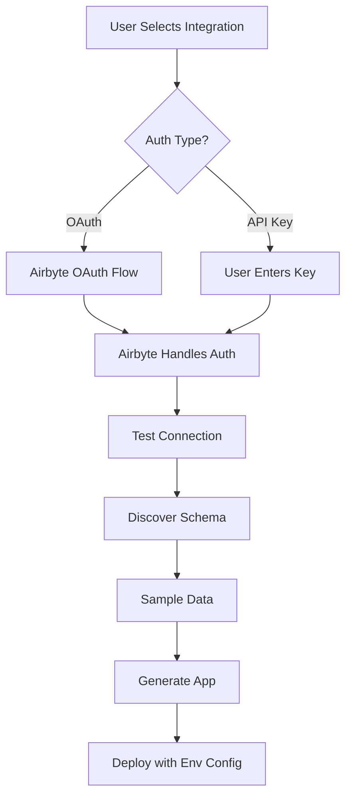

# Airbyte Integration Guide

## Overview

OpsAI uses Airbyte Cloud to handle all data integrations. Users connect their business tools through Airbyte's OAuth flow, and we automatically sync their data to build custom applications.

## How It Works



## Integration Flow

### 1. User Connects Data Sources

```typescript
// User sees recommended integrations
const recommendations = await getRecommendations(businessProfile)
// e.g., ["salesforce", "stripe", "slack", "google-analytics"]

// User clicks "Connect Salesforce"
const { authUrl } = await createAirbyteSource("salesforce")

// Redirected to Airbyte OAuth
window.location.href = authUrl
```

### 2. Airbyte Handles OAuth

- User logs into Salesforce
- Authorizes data access
- Airbyte stores tokens securely
- Returns to our app

### 3. Test & Sample Data

```typescript
// Test connection
const testResult = await testConnection(sourceId)

// Get sample data and schema
const { streams, fields } = await sampleData(sourceId)
```

### 4. Generate Custom App

Each app gets its own `.env`:

```bash
# Generated app's .env
TENANT_ID=tenant_abc123
DATABASE_URL=postgresql://...?schema=tenant_abc123
AIRBYTE_WORKSPACE_ID=tenant_abc123_workspace

# Features based on integrations
STRIPE_ENABLED=true
SLACK_ENABLED=true
EMAIL_PROVIDER=sendgrid
```

## Supported Integrations

### Databases
- PostgreSQL
- MySQL
- MongoDB
- Snowflake
- BigQuery
- Redshift

### CRM & Sales
- Salesforce
- HubSpot
- Pipedrive
- Zoho CRM
- Copper
- Close.com

### E-commerce
- Shopify
- WooCommerce
- Magento
- BigCommerce
- Square Online
- Amazon Seller

### Payments
- Stripe
- PayPal
- Square
- Braintree
- Chargebee
- Recurly

### Marketing
- Mailchimp
- SendGrid
- Klaviyo
- Braze
- Marketo
- Pardot

### Analytics
- Google Analytics
- Mixpanel
- Amplitude
- Segment
- Heap
- Pendo

### Communication
- Slack
- Microsoft Teams
- Discord
- Twilio
- Intercom
- Zendesk

### Productivity
- Google Sheets
- Notion
- Airtable
- Asana
- Jira
- Monday.com

### File Storage
- Google Drive
- Dropbox
- AWS S3
- Box
- OneDrive

## Platform Architecture

### Main Platform `.env`
```bash
# Only platform-level services
SUPABASE_URL=...
SUPABASE_ANON_KEY=...
SUPABASE_SERVICE_ROLE_KEY=...
OPENAI_API_KEY=...
CLAUDE_API_KEY=...
AIRBYTE_API_KEY=...
VERCEL_API_TOKEN=...

# NO OAuth credentials needed!
# Airbyte handles all OAuth flows
```

### Generated App `.env`
```bash
# Tenant-specific configuration
TENANT_ID=...
DATABASE_SCHEMA=tenant_xyz
STORAGE_BUCKET=tenant-xyz-files

# Connection info (read-only)
AIRBYTE_WORKSPACE_ID=...
```

## Security & Isolation

1. **Multi-Tenant Isolation**
   - Each tenant has separate database schema
   - Isolated file storage buckets
   - Separate Redis namespaces
   - Independent Airbyte workspaces

2. **Token Security**
   - OAuth tokens stored in Airbyte Cloud
   - Never exposed to generated apps
   - Automatic token refresh
   - Encrypted at rest

3. **Data Access**
   - Apps only read from synced data
   - No direct API access
   - Row-level security in database

## Implementation

### API Endpoints

```typescript
// List available sources
GET /api/airbyte/sources

// Get recommendations
POST /api/airbyte/recommendations
{
  businessProfile: { industry, size, type }
}

// Create source
POST /api/airbyte/sources/create
{
  tenantId,
  sourceType,
  name
}

// Test connection
POST /api/airbyte/sources/test
{
  sourceId
}

// Sample data
POST /api/airbyte/sources/sample
{
  sourceId
}
```

### Component Usage

```tsx
import AirbyteIntegrationHub from '@/components/AirbyteIntegrationHub'

<AirbyteIntegrationHub
  tenantId={tenantId}
  businessProfile={businessProfile}
  onIntegrationsComplete={(connections) => {
    // Proceed to app generation
  }}
/>
```

## Advantages

1. **No OAuth Management**: Airbyte handles all OAuth complexity
2. **350+ Connectors**: Access to Airbyte's entire connector library
3. **Automatic Updates**: Airbyte maintains connectors
4. **Enterprise Security**: SOC2 compliant, encrypted tokens
5. **Scalability**: Each tenant gets isolated resources

## Cost Optimization

- Use Airbyte Cloud free tier (14-day trial)
- Or self-host Airbyte OSS with our OAuth proxy
- Batch syncs to minimize API calls
- Use incremental sync modes

## Troubleshooting

### "Connection Failed"
- Check Airbyte API key is valid
- Verify source credentials
- Check API rate limits

### "No Data Found"
- Ensure user has data in source
- Check sync has completed
- Verify schema mapping

### "OAuth Error"
- User may have denied access
- Check redirect URL configuration
- Verify Airbyte workspace settings