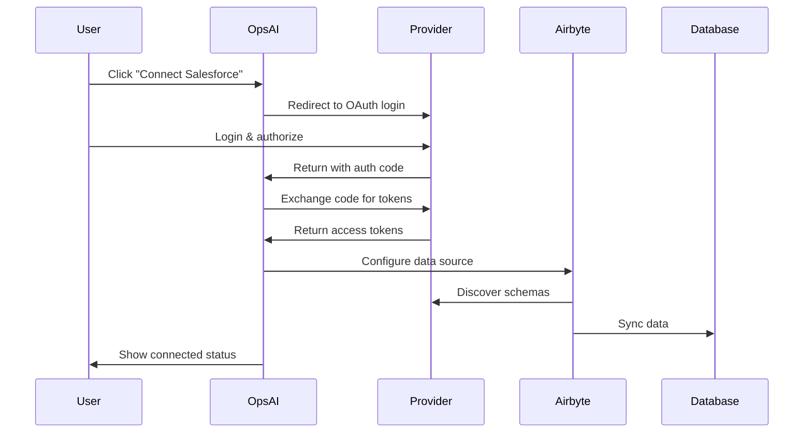

# OAuth Setup Guide

## Overview

OpsAI uses OAuth 2.0 to securely connect to your business tools. Users login through their provider accounts, and we fetch data via their APIs using Airbyte for continuous synchronization.

## How It Works

1. **User Authorization**: Users click "Connect" and login to their provider account
2. **Token Exchange**: We receive authorization codes and exchange them for access tokens
3. **Data Discovery**: Airbyte discovers available data schemas from connected services
4. **Continuous Sync**: Data is synchronized to tenant-specific databases
5. **App Generation**: Custom apps are built based on real business data

## Supported Providers

### CRM & Sales
- **Salesforce**: Customer data, opportunities, leads
- **HubSpot**: Contacts, companies, deals, forms
- **Stripe**: Payments, customers, subscriptions, invoices

### E-commerce
- **Shopify**: Products, orders, customers, inventory
- **Square**: Payments, customers, catalog, inventory
- **PayPal**: Transactions, payouts, disputes

### Productivity
- **Google Workspace**: Calendar, Drive, Gmail, Contacts
- **Microsoft 365**: Outlook, OneDrive, Teams
- **Slack**: Messages, channels, users
- **Notion**: Databases, pages, users

### Accounting
- **QuickBooks**: Invoices, expenses, customers, vendors
- **Xero**: Transactions, contacts, invoices

### Development
- **GitHub**: Repositories, issues, pull requests
- **Linear**: Issues, projects, cycles

### Other
- **Zoom**: Meetings, recordings, users
- **Mailchimp**: Audiences, campaigns, automations

## Setting Up OAuth Apps

### 1. Google Workspace

1. Go to [Google Cloud Console](https://console.cloud.google.com)
2. Create a new project or select existing
3. Enable required APIs:
   - Google Calendar API
   - Google Drive API
   - Gmail API
4. Create OAuth 2.0 credentials:
   - Application type: Web application
   - Authorized redirect URIs: `https://yourapp.com/api/oauth/callback`
5. Copy Client ID and Client Secret to `.env`

### 2. Salesforce

1. Go to [Salesforce Setup](https://login.salesforce.com)
2. Navigate to Apps → App Manager → New Connected App
3. Enable OAuth Settings:
   - Callback URL: `https://yourapp.com/api/oauth/callback`
   - Selected OAuth Scopes: api, refresh_token, offline_access
4. Copy Consumer Key (Client ID) and Consumer Secret to `.env`

### 3. Shopify

1. Go to [Shopify Partners](https://partners.shopify.com)
2. Create a new app
3. Set up OAuth:
   - App URL: `https://yourapp.com`
   - Allowed redirection URL: `https://yourapp.com/api/oauth/callback`
4. Copy API key and API secret key to `.env`

### 4. Stripe

1. Go to [Stripe Dashboard](https://dashboard.stripe.com)
2. Navigate to Settings → Connect Settings
3. Set up OAuth:
   - Redirect URI: `https://yourapp.com/api/oauth/callback`
4. Copy Client ID and Secret Key to `.env`

### 5. HubSpot

1. Go to [HubSpot App Dashboard](https://app.hubspot.com/developers)
2. Create a new app
3. Set up OAuth:
   - Redirect URLs: `https://yourapp.com/api/oauth/callback`
   - Scopes: crm.objects.contacts.read, etc.
4. Copy Client ID and Client Secret to `.env`

## User Flow



## Security Considerations

1. **Token Storage**: All tokens are encrypted and stored in Supabase
2. **Scope Limitations**: Request only necessary scopes
3. **Token Refresh**: Automatic refresh for expired tokens
4. **Tenant Isolation**: Each tenant's data is completely isolated
5. **SSL/TLS**: All communications are encrypted

## Troubleshooting

### Common Issues

1. **"Invalid redirect URI"**
   - Ensure callback URL matches exactly in provider settings
   - Check for trailing slashes

2. **"Access denied"**
   - User may have denied permissions
   - Check required scopes are configured

3. **"Token expired"**
   - Implement automatic token refresh
   - Check refresh token is stored

4. **"Rate limit exceeded"**
   - Implement exponential backoff
   - Check API usage limits

## Best Practices

1. **Minimal Scopes**: Only request data you need
2. **User Consent**: Clearly explain what data will be accessed
3. **Error Handling**: Graceful fallbacks for connection failures
4. **Data Privacy**: Follow GDPR/CCPA requirements
5. **Regular Audits**: Review connected accounts periodically

## API Endpoints

### Initiate OAuth Flow
```
POST /api/oauth/connect
{
  "provider": "salesforce",
  "tenantId": "tenant_123",
  "shopDomain": "myshop" // For Shopify only
}
```

### OAuth Callback
```
GET /api/oauth/callback?code=xxx&state=xxx
```

### Check Connection Status
```
GET /api/oauth/status?tenant=tenant_123&provider=salesforce
```

### List Connected Services
```
GET /api/oauth/connections?tenant=tenant_123
```

### Disconnect Service
```
DELETE /api/oauth/disconnect
{
  "tenantId": "tenant_123",
  "provider": "salesforce"
}
```