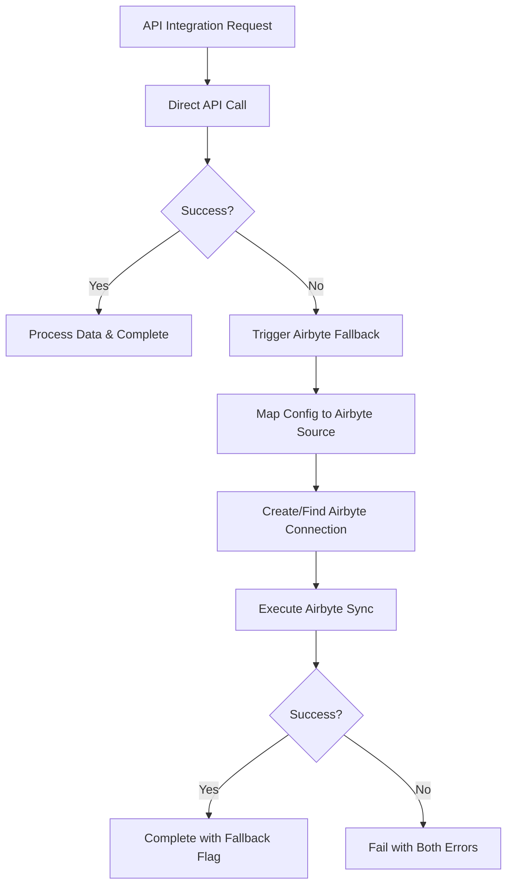

# Airbyte Integration & Fallback System

The CORE Platform now includes **Airbyte** as an intelligent fallback mechanism for data integrations. When direct API integrations fail, the system automatically falls back to Airbyte for reliable data synchronization.

## How It Works



## Configuration

### Environment Variables

```bash
# Airbyte Cloud API (recommended)
AIRBYTE_API_KEY=your_api_key_here
AIRBYTE_WORKSPACE_ID=your_workspace_id

# Or OAuth 2.0 (alternative)
AIRBYTE_CLIENT_ID=your_client_id
AIRBYTE_CLIENT_SECRET=your_client_secret

# Optional: Custom Airbyte instance
AIRBYTE_BASE_URL=https://api.airbyte.com/v1
```

### YAML Integration Config

Any integration in your vertical YAML will automatically have Airbyte fallback:

```yaml
apis:
  integrations:
    - name: external_crm
      type: rest
      base_url: https://api.external-crm.com
      authentication:
        type: api_key
        header: X-API-Key
        secret_name: crm_api_key
      endpoints:
        - name: get_contacts
          path: /contacts
          method: GET
      # Airbyte fallback is automatic - no additional config needed!
```

## Supported Data Sources

The Airbyte connector automatically maps your integration configs to appropriate Airbyte sources:

### REST APIs
- **Maps to**: `source-http-request`
- **Supports**: API keys, Bearer tokens, Basic auth, OAuth 2.0
- **Auto-detects**: Request methods, headers, authentication

### Databases
- **PostgreSQL** → `source-postgres`
- **MySQL** → `source-mysql` 
- **MongoDB** → `source-mongodb-v2`
- **Auto-configures**: Connection strings, SSL, replication methods

### File Sources
- **Maps to**: `source-file`
- **Supports**: CSV, JSON, Excel files
- **Storage**: HTTPS, S3, local files

## Usage Examples

### 1. Programmatic Usage

```typescript
import { IntegrationService } from '@opsai/integration';

const integrationService = new IntegrationService();

// Create integration with automatic Airbyte fallback
const integration = await integrationService.createIntegration({
  id: 'crm-sync',
  name: 'CRM Data Sync',
  type: 'rest',
  baseUrl: 'https://api.crm.com',
  authentication: {
    type: 'api_key',
    apiKey: process.env.CRM_API_KEY
  },
  endpoints: [
    { name: 'contacts', path: '/contacts', method: 'GET' }
  ]
}, 'tenant-123');

// Trigger sync - will try direct API first, then Airbyte if it fails
const syncJob = await integrationService.createSyncJob({
  integrationId: 'crm-sync',
  tenantId: 'tenant-123'
});
```

### 2. Direct Airbyte Usage

```typescript
import { createAirbyteConnector } from '@opsai/integration';

const airbyte = createAirbyteConnector();
await airbyte.connect();

// Sync data from any supported source
const result = await airbyte.execute('sync', {
  sourceConfig: {
    name: 'my-database',
    sourceType: 'source-postgres',
    configuration: {
      host: 'localhost',
      port: 5432,
      database: 'mydb',
      username: 'user',
      password: 'pass'
    }
  },
  schedule: 'daily'
});

console.log(`Synced ${result.recordCount} records`);
```

### 3. Generated Application Usage

When you generate a vertical application, Airbyte fallback is built-in:

```bash
# Generate any vertical (insurance, CRM, etc.)
pnpm cli generate vertical my-crm --config=crm.yml

# The generated app automatically includes:
# - Direct API integrations
# - Airbyte fallback for all APIs
# - Monitoring and alerting
# - Multi-tenant data isolation
```

## Monitoring & Observability

### Sync Result Metadata

```typescript
{
  success: true,
  recordsProcessed: 1500,
  metadata: {
    method: 'airbyte-fallback',  // Indicates fallback was used
    fallbackUsed: true,
    airbyteJobId: 'job_123',
    airbyteConnectionId: 'conn_456',
    duration: 45000,            // milliseconds
    dataSize: 2048000,          // bytes
    directSyncErrors: [         // Original API errors
      'API rate limit exceeded',
      'Authentication failed'
    ]
  }
}
```

### Logging & Alerts

The system automatically:
- ✅ Logs when fallback is triggered
- ✅ Tracks success rates for direct vs fallback
- ✅ Triggers alerts when integrations consistently fail
- ✅ Provides metrics for monitoring dashboards

## Data Flow & Storage

### Default Destination

By default, Airbyte syncs data to your application's PostgreSQL database in the `airbyte_synced` schema:

```sql
-- Data is automatically synced to tables like:
-- airbyte_synced.contacts
-- airbyte_synced.orders  
-- airbyte_synced.products
```

### Custom Destinations

You can configure custom destinations in your integration config:

```yaml
apis:
  integrations:
    - name: warehouse_sync
      type: rest
      base_url: https://api.external.com
      airbyte_destination:
        type: snowflake
        configuration:
          host: your-account.snowflakecomputing.com
          database: WAREHOUSE
          warehouse: COMPUTE_WH
          username: ${secrets.snowflake_user}
          password: ${secrets.snowflake_pass}
```

## Error Handling & Retries

### Automatic Retries
- **Direct API**: 3 retries with exponential backoff
- **Airbyte Fallback**: 5 minutes timeout with job status polling
- **Connection Issues**: Auto-reconnection with token refresh

### Error Classification
```typescript
// Errors that trigger Airbyte fallback:
- Network timeouts
- API rate limiting  
- Authentication failures
- Service unavailable (5xx errors)

// Errors that don't trigger fallback:
- Invalid configuration
- Data validation errors
- Permission denied (4xx errors)
```

## Performance & Scalability

### Concurrent Syncs
- Multiple integrations sync in parallel
- BullMQ queue manages job distribution
- Redis handles state and coordination

### Resource Usage
- **Memory**: ~50MB per active sync job
- **Network**: Optimized for large datasets
- **Storage**: Compressed data transfer

### Rate Limiting
- Respects API rate limits
- Queues requests during high traffic
- Automatic backoff and retry

## Troubleshooting

### Common Issues

#### 1. Airbyte Connection Failed
```bash
# Check credentials
echo $AIRBYTE_API_KEY
echo $AIRBYTE_CLIENT_ID

# Test connection
curl -H "Authorization: Bearer $AIRBYTE_API_KEY" \
     https://api.airbyte.com/v1/workspaces
```

#### 2. Source Mapping Issues
```typescript
// Check logs for mapping errors
console.log('Source config:', mapConfigToAirbyteSource(integrationConfig));

// Supported source types:
- source-http-request (REST APIs)
- source-postgres (PostgreSQL) 
- source-mysql (MySQL)
- source-mongodb-v2 (MongoDB)
- source-file (CSV/JSON files)
```

#### 3. Data Not Syncing
```sql
-- Check if data arrived in database
SELECT * FROM airbyte_synced.your_table_name LIMIT 10;

-- Check sync job status
SELECT * FROM integrations 
WHERE name = 'your-integration' 
ORDER BY updated_at DESC;
```

### Debug Mode

```bash
# Enable debug logging
export LOG_LEVEL=debug
export DEBUG=airbyte:*

# Run your application
npm run dev
```

## Security Considerations

### Credentials Management
- ✅ API keys stored in environment variables
- ✅ Secrets encrypted at rest
- ✅ No credentials in logs or error messages
- ✅ Automatic token rotation for OAuth

### Data Privacy
- ✅ Multi-tenant data isolation
- ✅ Encrypted data transfer (TLS)
- ✅ Configurable data retention
- ✅ GDPR/CCPA compliance options

### Access Control
- ✅ Integration-level permissions
- ✅ Tenant-scoped access
- ✅ Audit logging for all operations
- ✅ Role-based access control (RBAC)

## Advanced Configuration

### Custom Source Types

You can extend the Airbyte connector for custom sources:

```typescript
import { AirbyteConnector } from '@opsai/integration';

class CustomAirbyteConnector extends AirbyteConnector {
  protected mapConfigToAirbyteSource(config: IntegrationConfig): any {
    if (config.type === 'custom-api') {
      return {
        name: `custom-${config.name}`,
        sourceType: 'source-custom-connector',
        configuration: {
          // Your custom mapping logic
        }
      };
    }
    
    return super.mapConfigToAirbyteSource(config);
  }
}
```

### Webhooks for Real-time Updates

```yaml
apis:
  integrations:
    - name: realtime_updates
      type: webhook
      webhook_url: https://your-app.com/webhooks/data-update
      airbyte_schedule: hourly  # Fallback sync frequency
```

## Migration Guide

### From Direct APIs Only

If you have existing integrations without Airbyte fallback:

1. **Update your .env**:
   ```bash
   AIRBYTE_API_KEY=your_key_here
   AIRBYTE_WORKSPACE_ID=your_workspace_id
   ```

2. **Rebuild your integrations**:
   ```bash
   pnpm cli generate vertical your-app --config=config.yml
   ```

3. **Test fallback behavior**:
   ```bash
   # Simulate API failure to trigger fallback
   npm run test:integration -- --force-fallback
   ```

### From Custom Solutions

Replace custom sync logic with CORE Platform:

```typescript
// Before: Custom sync logic
const syncData = async () => {
  try {
    const response = await fetch('https://api.external.com/data');
    // Custom processing...
  } catch (error) {
    // Manual fallback logic...
  }
};

// After: CORE Platform with automatic fallback
const integrationService = new IntegrationService();
const result = await integrationService.executeSync('integration-id');
// Automatic fallback, error handling, monitoring included!
```

## Contributing

To extend the Airbyte integration:

1. **Add new source types** in `mapConfigToAirbyteSource()`
2. **Add new authentication methods** in `mapAuthToAirbyte()` 
3. **Add new destination types** in `mapDatabaseToAirbyte()`
4. **Add tests** in `src/__tests__/airbyte-connector.test.ts`

See [CONTRIBUTING.md](../../CONTRIBUTING.md) for detailed guidelines.

---

## 🚀 Ready to Use!

The Airbyte fallback system is now fully integrated into the CORE Platform. Every generated vertical application automatically includes:

- ✅ **Intelligent fallback** when APIs fail
- ✅ **200+ pre-built connectors** via Airbyte
- ✅ **Enterprise-grade reliability**
- ✅ **Zero additional configuration** required

Generate your next vertical and experience bulletproof data integrations! 🎯