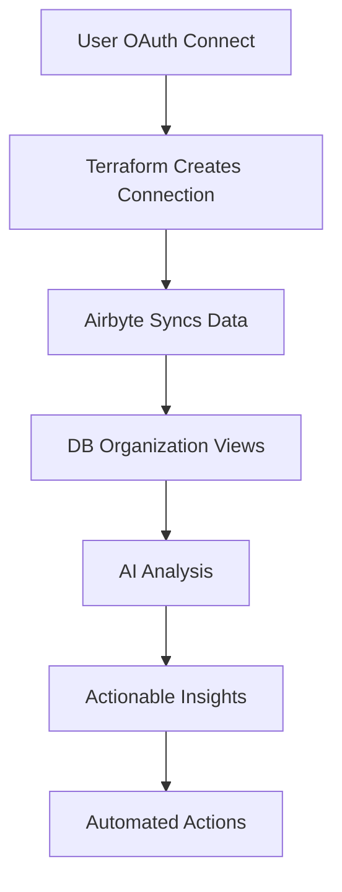

# Complete Workflow Automation

## Overview

This system provides end-to-end automation from OAuth connection to AI-powered insights:



## 1. Fixed Connection Issues

### Problem: 500 Errors
- **Cause**: Missing or invalid configuration parameters
- **Solution**: Added proper namespace, prefix, and schema update handling

### Fixed Configuration:
```hcl
# Each connection now has:
- namespace_definition = "custom"
- namespace_format = "user_${var.user_id}"
- prefix = "stripe_" / "github_" / "shopify_"
- non_breaking_schema_updates_behavior = "propagate_columns"
```

## 2. Database Organization

### After Airbyte Sync:
```sql
-- Raw tables (created by Airbyte)
user_123.stripe_customers
user_123.stripe_charges
user_123.github_repositories
user_123.shopify_orders

-- Organized views (created by our SQL)
analytics.unified_customers     -- 360° customer view
analytics.developer_activity    -- GitHub productivity
analytics.revenue_analytics     -- Financial trends
analytics.website_analytics     -- Traffic patterns
analytics.user_dashboard_summary -- Materialized for speed
```

## 3. AI Analysis Workflow

### Automatic Daily Analysis:
1. **Data Collection**: Fetches from organized views
2. **Pattern Analysis**: Detects trends, seasonality, anomalies
3. **AI Insights**: GPT-4 generates contextual insights
4. **Recommendations**: Creates prioritized action items
5. **Alerts**: Notifies on high-priority issues

### Example Output:
```json
{
  "user_id": "123",
  "health_score": 85,
  "churn_risk": "low",
  "insights": {
    "strengths": [
      "Consistent revenue growth (15% MoM)",
      "High developer productivity (50+ PRs/month)",
      "Low bounce rate (32%)"
    ],
    "improvements": [
      "PR merge time above average (3.5 days)",
      "Customer support response time increasing",
      "Mobile traffic conversion low"
    ]
  },
  "recommendations": [
    {
      "priority": "high",
      "action": "Implement PR automation",
      "impact": "Save 5 hours/week"
    }
  ]
}
```

## 4. Implementation Steps

### Step 1: Deploy Fixed Terraform
```bash
# Use the fixed configurations
terraform apply -var="user_id=123"
```

### Step 2: Run DB Organization
```bash
# After Airbyte creates tables
psql -f db_organization_views.sql
```

### Step 3: Start AI Analysis
```python
# Run daily
python ai_analysis_workflow.py
```

### Step 4: Create Automations
```javascript
// React to insights
if (analysis.churn_risk === 'high') {
  await scheduleCustomerCall(user_id);
  await offerDiscount(user_id, 20);
}
```

## 5. Complete Flow Example

### User Connects Stripe:
```javascript
// 1. OAuth Complete
const stripeToken = "sk_live_xxx";

// 2. Update Terraform
await terraform.apply({
  user_id: "123",
  stripe_api_key: stripeToken
});

// 3. Wait for sync (automatic)
// Airbyte creates: user_123.stripe_*

// 4. Query organized data
const revenue = await db.query(`
  SELECT * FROM analytics.revenue_analytics 
  WHERE user_id = '123'
`);

// 5. Get AI insights
const insights = await analyzer.analyze_user_workflow("123");

// 6. Take action
if (insights.recommendations[0].priority === 'high') {
  await automateAction(insights.recommendations[0]);
}
```

## Benefits

1. **Isolated Data**: Each user in their own schema
2. **Organized Views**: Ready-to-query analytics
3. **AI Insights**: Proactive recommendations
4. **Automation**: Actions triggered by patterns
5. **Scalable**: Works for 1 or 10,000 users

## Monitoring

```sql
-- Check sync status
SELECT 
  connection_name,
  last_sync_at,
  records_synced,
  status
FROM airbyte_sync_history
WHERE user_id = '123'
ORDER BY last_sync_at DESC;

-- Monitor AI analysis
SELECT 
  user_id,
  health_score,
  churn_risk,
  created_at
FROM ai_workflow_analysis
WHERE created_at > NOW() - INTERVAL '7 days';
```

## Next Steps

1. **Add More Sources**: Slack, Zendesk, Intercom
2. **Enhance AI**: Custom ML models for your domain
3. **Automate Actions**: Trigger workflows from insights
4. **Real-time Processing**: Stream processing for instant insights
5. **Custom Dashboards**: User-specific analytics UI